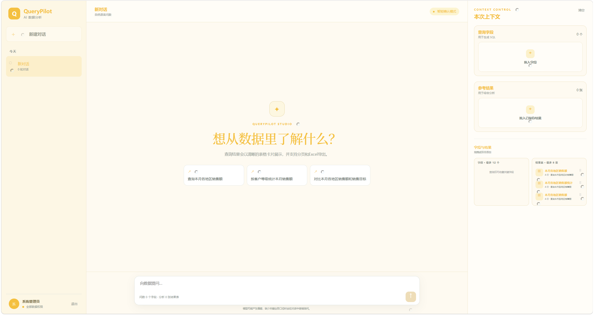
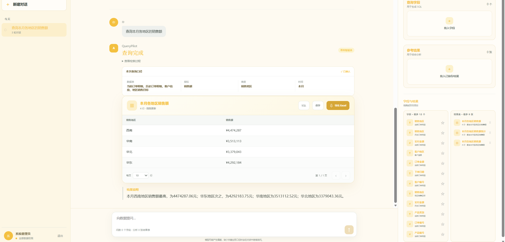
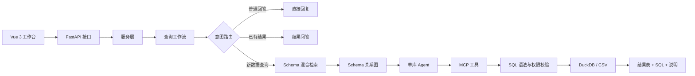
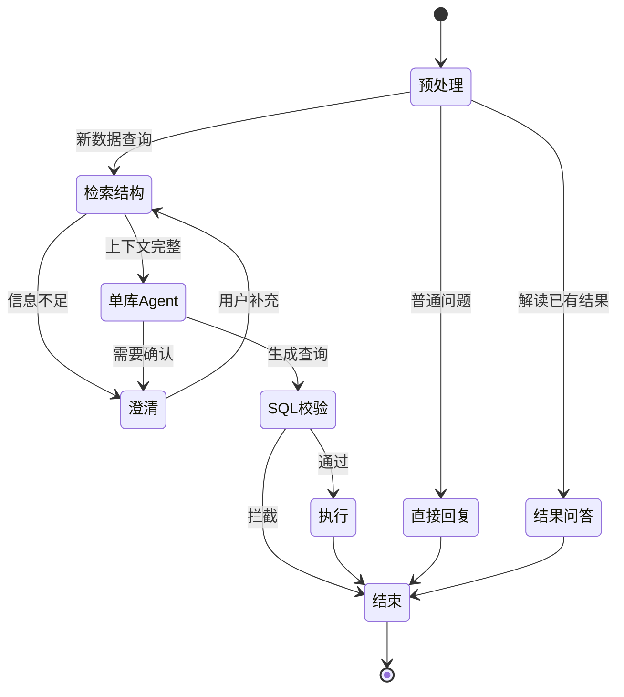

# QueryPilot Data Agent

[中文说明](README.zh-CN.md)

QueryPilot is a natural-language data query agent for structured databases. It turns a business question into a read-only query and presents the result in a small web workbench.

## Product screenshots

The repository is documented with product screenshots; run the full application locally using the installation steps below.





The screenshots show the QueryPilot workbench and query result view. The full application can be run locally with the steps below.

## What is included

- intent routing between a new query and a follow-up question;
- keyword and semantic field retrieval with rank fusion and reranking;
- schema graph construction for table relationships;
- single-database query agent and local tool calls;
- read-only, single-statement, table-access and dangerous-operation checks;
- a Vue workbench for conversations, results, SQL inspection and export.

The current application is intentionally limited to single-database execution. Multi-database task splitting and result merging are not enabled.

## Core architecture and workflow





The request path is: **Vue workbench → FastAPI API → service layer → query workflow → route selection**. A normal response ends at a direct answer or saved-result analysis. A new data request continues through schema retrieval, schema relationships, the single-database agent, local MCP runtime, SQL AST and permission checks, database execution, and result presentation.

| Layer | Main modules | Responsibility |
|---|---|---|
| Interaction | `frontend/src/App.vue`, `api.ts` | Login, conversation, schema browsing, clarification, result table and export |
| API | `backend/app/api/routes.py` | HTTP endpoints, authentication dependencies, request/response models |
| Service | `backend/app/services/askdata_service.py` | User isolation, sessions, workspaces, archives and workflow invocation |
| Orchestration | `backend/app/workflows/query_graph.py` | Routing, retrieval, clarification, execution and terminal states |
| Knowledge | `backend/app/retrieval/service.py`, `graph.py` | Field retrieval, rank fusion, reranking and relationship completion |
| Agent | `backend/app/querying/single_database_agent.py`, `skills/` | Decide whether to clarify or call an allowed database tool |
| Tool execution | `backend/app/mcp_runtime/`, `duckdb_engine.py` | Tool registration, SQL validation and query execution |
| Security and state | `backend/app/security/`, `services/*memory*` | Authentication, table permissions, short-term context and optional saved memory |

### Workflow states

1. **Preprocess** — normalize the request and determine whether it is a direct answer, an existing-result question, or a new data query.
2. **Retrieve schema** — identify relevant fields and tables using keyword/semantic retrieval, rank fusion and reranking.
3. **Build context** — construct table relationships and provide the bounded schema context to the single-database agent.
4. **Clarify or execute** — ask for missing business conditions, or generate a read-only SQL statement and call the registered tool.
5. **Validate and present** — apply SQL AST, statement, table-access and dangerous-operation checks, execute the query, then return the table, SQL and explanation.

## Run the full local application

### Backend

Python 3.11 is recommended on Windows. Create `backend/.env` from `.env.example` and set the model endpoint and key.

```powershell
cd backend
python -m venv .venv
.\.venv\Scripts\Activate.ps1
python -m pip install -r requirements.txt
python run.py
```

### Frontend

```powershell
cd frontend
npm install
npm run dev
```

Open the URL printed by Vite. The full application calls the configured model service.

## Evaluation snapshot

The portfolio comparison uses the same 80-question evaluation set. The baseline run does not inject business evidence; the evidence-assisted run adds the official evidence field when available.

| Metric | Result |
|---|---:|
| Final schema field recall | 81.01% |
| Final schema field precision | 31.04% |
| Query execution accuracy | 43.75% (35/80) → 53.75% (43/80) with evidence |
| End-to-end latency, median | 57.67 s |
| End-to-end latency, p95 | 92.94 s |

These figures are an engineering evaluation snapshot, not a production guarantee. Infrastructure failures are reported separately.

## Privacy and security

- Screenshots and evaluation materials in this repository are sanitized; no production data is included.
- The application is designed for read-only, single-statement queries and checks table access and dangerous operations before execution.
- Do not commit API keys, production exports, customer data, logs, or local database files. Use environment variables or a secret manager for credentials.
- Before production use, add organization-specific authentication, authorization, audit retention, masking, and approval policies; the repository does not claim to provide those policies by default.

## Next steps

1. Add a deployable demo data package and a documented data-connection configuration.
2. Expand evaluation with reproducible datasets, multi-turn cases, and independent infrastructure metrics.
3. Strengthen schema relationship handling and SQL dialect compatibility across supported databases.
4. Add deployment guidance, automated checks, and organization-specific access-control adapters.

## Repository scope

This repository contains the runnable product core and a self-contained UI demo. Internal benchmark datasets, traces, temporary diagnosis scripts, local databases, logs and secrets are excluded.

## License

MIT. See [LICENSE](LICENSE).
