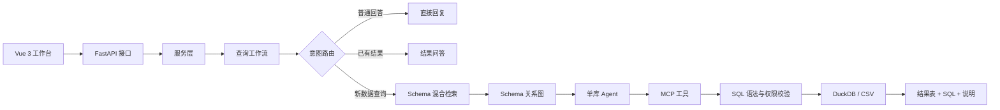
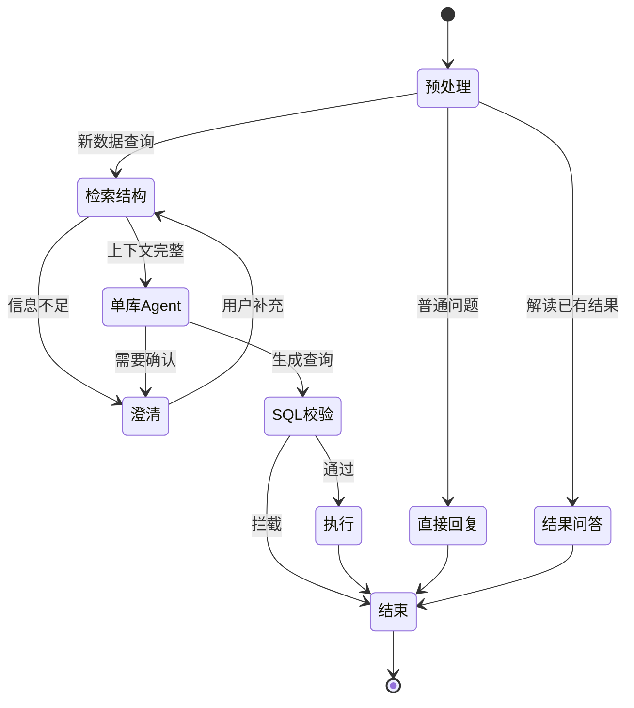

# QueryPilot 数据查询智能体

[English README](README.md)

QueryPilot 面向结构化数据库，将业务人员的自然语言问题转换为只读查询，并通过网页工作台展示结果。

## 产品截图

仓库通过产品截图展示主要页面；完整应用可按下方安装步骤在本地运行。


两张截图分别展示 QueryPilot 工作台和查询结果页面。完整应用可按下方步骤在本地运行。

## 当前包含的能力

- 区分新查询与上下文追问；
- 结合关键词、语义匹配、排名融合和重排序定位相关字段；
- 根据表间关系构建结构图；
- 通过单库查询智能体调用本地工具；
- 执行前检查只读语句、单条语句、表访问权限和危险操作；
- 提供对话、结果表格、查询语句查看和导出功能。

当前版本限定为单数据库执行，多数据库任务拆分和结果合并尚未启用。

## 核心架构与工作流





请求链路为：**Vue 工作台 → FastAPI 接口 → 服务层 → 查询工作流 → 意图路由**。普通问答会进入直接回复或已有结果分析；新数据查询则继续经过结构检索、表关系构建、单库智能体、本地 MCP 工具、SQL 语法树与权限校验、数据库执行和结果展示。

| 层级 | 核心模块 | 主要责任 |
|---|---|---|
| 交互层 | `frontend/src/App.vue`、`api.ts` | 登录、对话、Schema 浏览、澄清、结果表和导出 |
| API 层 | `backend/app/api/routes.py` | HTTP 接口、认证依赖、请求与响应模型 |
| 服务层 | `backend/app/services/askdata_service.py` | 用户隔离、会话、工作区、归档和工作流调用 |
| 编排层 | `backend/app/workflows/query_graph.py` | 路由、检索、澄清、执行和结束状态转换 |
| 知识层 | `backend/app/retrieval/service.py`、`graph.py` | 字段召回、融合重排和表关系补全 |
| Agent 层 | `backend/app/querying/single_database_agent.py`、`skills/` | 决定澄清或调用允许的数据库工具 |
| 工具执行层 | `backend/app/mcp_runtime/`、`duckdb_engine.py` | 工具注册、SQL 校验和查询执行 |
| 安全与状态层 | `backend/app/security/`、`services/*memory*` | 认证、表权限、短期上下文和可选保存记忆 |

### 工作流状态

1. **预处理**：规范化问题，判断是普通回复、已有结果解读，还是全新数据查询。
2. **检索结构**：通过关键词/语义检索、排名融合和重排序定位相关字段与表。
3. **构建上下文**：构建表间关系，并把受控的结构上下文交给单库智能体。
4. **澄清或执行**：信息不足时追问；信息完整时生成只读查询并调用已注册工具。
5. **校验与呈现**：依次执行 SQL 语法树、单语句、表访问权限和危险操作校验，查询后返回表格、SQL 和说明。

## 运行完整本地应用

### 启动后端

Windows 推荐使用 Python 3.11。先根据 `.env.example` 创建 `backend/.env`，填写模型接口地址和密钥。

```powershell
cd backend
python -m venv .venv
.\.venv\Scripts\Activate.ps1
python -m pip install -r requirements.txt
python run.py
```

### 启动前端

```powershell
cd frontend
npm install
npm run dev
```

打开前端开发服务器输出的地址。完整应用会调用配置的模型服务。

## 评测结果摘要

以下数字来自项目中 80 条问题的评测记录。加入业务背景说明的运行中，79 条完整执行，1 条被标记为基础设施失败。

| 指标 | 结果 |
|---|---:|
| 最终输入结构字段召回率 | 82.97% |
| 最终输入结构字段精确率 | 31.04% |
| 查询执行准确率 | 53.16%（42/79） |
| 端到端耗时中位数 | 57.67 秒 |
| 端到端耗时95分位数 | 92.94 秒 |

这些数字是工程评测快照，不是生产环境承诺。网络或模型接口故障单独统计，不混入能力指标。

## 隐私与安全

- 仓库中的截图和评测材料均已脱敏，不包含生产数据。
- 应用按只读、单条查询设计，并在执行前检查表访问范围和危险操作。
- 不要提交模型密钥、生产数据导出文件、客户数据、日志或本地数据库；凭证应通过环境变量或密钥管理服务提供。
- 正式部署前仍需结合组织制度补充身份认证、权限分级、审计留存、敏感字段脱敏和高风险查询审批；本仓库不默认替代这些制度。

## 后续工作

1. 补充可直接部署的演示数据包和数据连接配置说明。
2. 扩展可复现评测，覆盖多轮问题、更多业务场景，并单独统计基础设施指标。
3. 继续完善表关系处理和不同数据库方言的查询兼容性。
4. 增加部署指南、自动化质量检查和面向具体组织的权限适配器。

## 仓库范围

公开仓库包含可运行的产品核心代码和自包含的界面演示。内部评测数据、运行记录、临时诊断脚本、本地数据库、日志和密钥均未上传。

## 许可证

MIT，详见 [LICENSE](LICENSE)。
